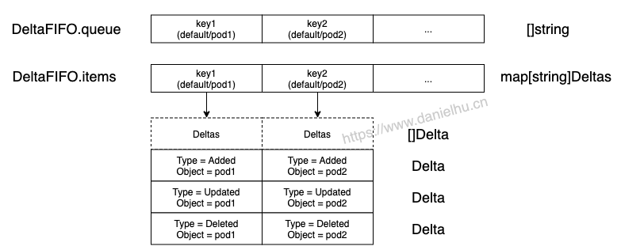

# DeltaFIFO 源码分析



## Queue 接口

类似 workqueue 里的队列概念，这里也有一个队列，Queue 接口定义在 client-go/tools/cache 包中的 fifo.go 文件里，看下有哪些方法

```go
// Queue extends Store with a collection of Store keys to "process".
// Every Add, Update, or Delete may put the object's key in that collection.
// A Queue has a way to derive the corresponding key given an accumulator.
// A Queue can be accessed concurrently from multiple goroutines.
// A Queue can be "closed", after which Pop operations return an error.
type Queue interface {
	Store

	// Pop blocks until there is at least one key to process or the
	// Queue is closed.  In the latter case Pop returns with an error.
	// In the former case Pop atomically picks one key to process,
	// removes that (key, accumulator) association from the Store, and
	// processes the accumulator.  Pop returns the accumulator that
	// was processed and the result of processing.  The PopProcessFunc
	// may return an ErrRequeue{inner} and in this case Pop will (a)
	// return that (key, accumulator) association to the Queue as part
	// of the atomic processing and (b) return the inner error from
	// Pop.
	Pop(PopProcessFunc) (interface{}, error)// 会阻塞，直到有一个元素可以被 pop 出来，或者队列关闭

	// AddIfNotPresent puts the given accumulator into the Queue (in
	// association with the accumulator's key) if and only if that key
	// is not already associated with a non-empty accumulator.
	AddIfNotPresent(interface{}) error

	// HasSynced returns true if the first batch of keys have all been
	// popped.  The first batch of keys are those of the first Replace
	// operation if that happened before any Add, AddIfNotPresent,
	// Update, or Delete; otherwise the first batch is empty.
	HasSynced() bool

	// Close the queue
	Close()
}
```
这里嵌里一个 Store 接口，对应定义如下：

```go
type Store interface {

	// Add adds the given object to the accumulator associated with the given object's key
	Add(obj interface{}) error

	// Update updates the given object in the accumulator associated with the given object's key
	Update(obj interface{}) error

	// Delete deletes the given object from the accumulator associated with the given object's key
	Delete(obj interface{}) error

	// List returns a list of all the currently non-empty accumulators
	List() []interface{}

	// ListKeys returns a list of all the keys currently associated with non-empty accumulators
	ListKeys() []string

	// Get returns the accumulator associated with the given object's key
	Get(obj interface{}) (item interface{}, exists bool, err error)

	// GetByKey returns the accumulator associated with the given key
	GetByKey(key string) (item interface{}, exists bool, err error)

	// Replace will delete the contents of the store, using instead the
	// given list. Store takes ownership of the list, you should not reference
	// it after calling this function.
	Replace([]interface{}, string) error

	// Resync is meaningless in the terms appearing here but has
	// meaning in some implementations that have non-trivial
	// additional behavior (e.g., DeltaFIFO).
	Resync() error
}
```
Store 接口的方法都比较直观，Store 的实现有很多，我们等下看 Queue 里用到的是哪个实现。

Queue 接口的实现是 FIFO 和 DeltaFIFO 两个类型，我们在 Informer 里用到的是 DeltaFIFO，而 DeltaFIFO 也没有依赖 FIFO，所以下面我们直接看 DeltaFIFO 是怎么实现的。

## DeltaFIFO

```go
type DeltaFIFO struct {
	// lock/cond protects access to 'items' and 'queue'.
	lock sync.RWMutex
	cond sync.Cond

	// `items` maps a key to a Deltas.
	// Each such Deltas has at least one Delta.
	items map[string]Deltas

	// `queue` maintains FIFO order of keys for consumption in Pop().
	// There are no duplicates in `queue`.
	// A key is in `queue` if and only if it is in `items`.
	queue []string // 这个 queue 里是没有重复元素的，和上面 items 的 key 保持一致

	// populated is true if the first batch of items inserted by Replace() has been populated
	// or Delete/Add/Update/AddIfNotPresent was called first.
	populated bool
	// initialPopulationCount is the number of items inserted by the first call of Replace()
	initialPopulationCount int

	// keyFunc is used to make the key used for queued item
	// insertion and retrieval, and should be deterministic.
	keyFunc KeyFunc // 用于构造上面 map 用到的 key

	// knownObjects list keys that are "known" --- affecting Delete(),
	// Replace(), and Resync()
	knownObjects KeyListerGetter // 用来检索所有的 keys

	// Used to indicate a queue is closed so a control loop can exit when a queue is empty.
	// Currently, not used to gate any of CRUD operations.
	closed bool

	// emitDeltaTypeReplaced is whether to emit the Replaced or Sync
	// DeltaType when Replace() is called (to preserve backwards compat).
	emitDeltaTypeReplaced bool

	// Called with every object if non-nil.
	transformer TransformFunc
}
```
这里有一个 Deltas 类型，看下具体的定义：

```go
type Deltas []Delta

type Delta struct {
	Type   DeltaType
	Object interface{}
}

type DeltaType string

// Change type definition
const (
	Added   DeltaType = "Added"
	Updated DeltaType = "Updated"
	Deleted DeltaType = "Deleted"
	// Replaced is emitted when we encountered watch errors and had to do a
	// relist. We don't know if the replaced object has changed.
	//
	// NOTE: Previous versions of DeltaFIFO would use Sync for Replace events
	// as well. Hence, Replaced is only emitted when the option
	// EmitDeltaTypeReplaced is true.
	Replaced DeltaType = "Replaced"
	// Sync is for synthetic events during a periodic resync.
	Sync DeltaType = "Sync"
)
```
可以看到 Delta 结构体保存的是 DeltaType（就是一个字符串）和发生了这种 Delta 的具体对象。

DeltaFIFO 内部主要维护的一个队列和一个 map，直观一点表示如下：


DeltaFIFO 的 New 函数是 NewDeltaFIFOWithOptions()

```go
func NewDeltaFIFOWithOptions(opts DeltaFIFOOptions) *DeltaFIFO {
	if opts.KeyFunction == nil {
		opts.KeyFunction = MetaNamespaceKeyFunc
	}

	f := &DeltaFIFO{
		items:        map[string]Deltas{},
		queue:        []string{},
		keyFunc:      opts.KeyFunction,
		knownObjects: opts.KnownObjects,

		emitDeltaTypeReplaced: opts.EmitDeltaTypeReplaced,
		transformer:           opts.Transformer,
	}
	f.cond.L = &f.lock
	return f
}
```

## 元素增删改 - queueActionLocked()
可以注意到 DeltaFIFO 的 Add() 等方法等方法体都很简短，大致这样：

```go
func (f *DeltaFIFO) Add(obj interface{}) error {
	f.lock.Lock()
	defer f.lock.Unlock()
	f.populated = true
	return f.queueActionLocked(Added, obj)
}

// Update is just like Add, but makes an Updated Delta.
func (f *DeltaFIFO) Update(obj interface{}) error {
	f.lock.Lock()
	defer f.lock.Unlock()
	f.populated = true
	return f.queueActionLocked(Updated, obj)
}
```
里面的逻辑就是调用 queueActionLocked() 方法传递对应的 DeltaType 进去，前面提到过 DeltaType 就是 Added、Updated、Deleted 等字符串，所以我们直接先看 queueActionLocked() 方法的实现。


```go
// queueActionLocked appends to the delta list for the object.
// Caller must lock first.
func (f *DeltaFIFO) queueActionLocked(actionType DeltaType, obj interface{}) error {
	id, err := f.KeyOf(obj) // 计算这个对象的 key
	if err != nil {
		return KeyError{obj, err}
	}

	// Every object comes through this code path once, so this is a good
	// place to call the transform func.  If obj is a
	// DeletedFinalStateUnknown tombstone, then the containted inner object
	// will already have gone through the transformer, but we document that
	// this can happen. In cases involving Replace(), such an object can
	// come through multiple times.
	if f.transformer != nil {
		var err error
		obj, err = f.transformer(obj)
		if err != nil {
			return err
		}
	}

	oldDeltas := f.items[id] // 从 items map 里获取当前的 Deltas
	newDeltas := append(oldDeltas, Delta{actionType, obj}) // 构造一个 Delta，添加到 Deltas 中，也就是 []Delta 里
	newDeltas = dedupDeltas(newDeltas) // 如果最近两个 Delta 是重复的，则保留后一个；目前版本只处理的 Deleted 重复场景

	if len(newDeltas) > 0 { // 理论上 newDeltas 长度一定大于0
		if _, exists := f.items[id]; !exists {  // 如果 id 不存在，则在队列里添加
			f.queue = append(f.queue, id)
		}
		f.items[id] = newDeltas // 如果 id 已经存在，则只更新 items map 里对应这个 key 的 Deltas
		f.cond.Broadcast()
	} else { // 理论上这里执行不到
		// This never happens, because dedupDeltas never returns an empty list
		// when given a non-empty list (as it is here).
		// If somehow it happens anyway, deal with it but complain.
		if oldDeltas == nil {
			klog.Errorf("Impossible dedupDeltas for id=%q: oldDeltas=%#+v, obj=%#+v; ignoring", id, oldDeltas, obj)
			return nil
		}
		klog.Errorf("Impossible dedupDeltas for id=%q: oldDeltas=%#+v, obj=%#+v; breaking invariant by storing empty Deltas", id, oldDeltas, obj)
		f.items[id] = newDeltas
		return fmt.Errorf("Impossible dedupDeltas for id=%q: oldDeltas=%#+v, obj=%#+v; broke DeltaFIFO invariant by storing empty Deltas", id, oldDeltas, obj)
	}
	return nil
}```

到这里再反过来看 Add() Delete() Update() Get() 等函数，就很清晰了，只是将对应变化类型的 obj 添加到队列中。

## Pop()
Pop 按照元素的添加或更新顺序有序返回一个元素(Deltas)，在队列为空时会阻塞。另外 Pop 过程会先从队列中删除一个元素然后返回，所以如果处理失败了需要通过 AddIfNotPresent() 方法将这个元素加回到队列中。

Pop 的参数是 type PopProcessFunc func(interface{}) error 类型的 process，在 Pop() 函数中直接将队列里的第一个元素出队，然后丢给 process 处理，如果处理失败会重新入队，但是这个 Deltas 和对应的错误信息会被返回。

client-go/tools/cache/delta_fifo.go:

```go
func (f *DeltaFIFO) Pop(process PopProcessFunc) (interface{}, error) {
	f.lock.Lock()
	defer f.lock.Unlock()
	for {// 这个循环其实没有意义，和下面的 !ok 一起解决了一个不会发生的问题
		for len(f.queue) == 0 {// 如果为空则进入这个循环
			// When the queue is empty, invocation of Pop() is blocked until new item is enqueued.
			// When Close() is called, the f.closed is set and the condition is broadcasted.
			// Which causes this loop to continue and return from the Pop().
			if f.closed {// 队列关闭则直接返回
				return nil, ErrFIFOClosed
			}

			f.cond.Wait()// 等待
		}
		isInInitialList := !f.hasSynced_locked()
		id := f.queue[0] // queue 里放的是 key
		f.queue = f.queue[1:] // queue 中删除这个 key
		depth := len(f.queue)
		if f.initialPopulationCount > 0 {  // 第一次调用 Replace() 插入的元素数量
			f.initialPopulationCount--
		}
		item, ok := f.items[id] // 从 items map[string]Deltas 中获取一个 Deltas
		if !ok {
			// This should never happen
			klog.Errorf("Inconceivable! %q was in f.queue but not f.items; ignoring.", id)
			continue
		}
		delete(f.items, id) // items map 中也删除这个元素
		// Only log traces if the queue depth is greater than 10 and it takes more than
		// 100 milliseconds to process one item from the queue.
		// Queue depth never goes high because processing an item is locking the queue,
		// and new items can't be added until processing finish.
		// https://github.com/kubernetes/kubernetes/issues/103789
		if depth > 10 {// 当队列长度超过 10 并且处理一个元素时间超过 0.1 s 时打印日志；队列长度理论上不会变长因为处理一个元素时是阻塞的，这时候新的元素加不进来
			trace := utiltrace.New("DeltaFIFO Pop Process",
				utiltrace.Field{Key: "ID", Value: id},
				utiltrace.Field{Key: "Depth", Value: depth},
				utiltrace.Field{Key: "Reason", Value: "slow event handlers blocking the queue"})
			defer trace.LogIfLong(100 * time.Millisecond)
		}
		err := process(item, isInInitialList) // 丢给 PopProcessFunc 处理
		if e, ok := err.(ErrRequeue); ok { // 如果需要 requeue 则加回到队列里
			f.addIfNotPresent(id, item)
			err = e.Err
		}
		// Don't need to copyDeltas here, because we're transferring
		// ownership to the caller.
		return item, err // 返回这个 Deltas 和错误信息
	}
}
```

## Replace()
Replace() 简单地做两件事：

1. 给传入的对象列表添加一个 Sync/Replace DeltaType 的 Delta
2. 然后执行一些删除逻辑

这里的 Replace() 过程可以简单理解成传递一个新的 []Deltas 过来，如果当前 DeltaFIFO 里已经有这些元素，则追加一个 Sync/Replace 动作，反之 DeltaFIFO 里多出来的 Deltas 则可能是与 apiserver 失联导致实际已经删除，但是删除动作没有 watch 到的那些对象，所以直接追加一个 Deleted 的 Delta；

```go
func (f *DeltaFIFO) Replace(list []interface{}, _ string) error {
	f.lock.Lock()
	defer f.lock.Unlock()
	keys := make(sets.String, len(list))// 用来保存 list 中每个 item 的 key

	// keep backwards compat for old clients // 老代码兼容逻辑
	action := Sync
	if f.emitDeltaTypeReplaced {
		action = Replaced
	}

	// Add Sync/Replaced action for each new item.
	for _, item := range list {// 在每个 item 后面添加一个 Sync/Replaced 动作
		key, err := f.KeyOf(item)
		if err != nil {
			return KeyError{item, err}
		}
		keys.Insert(key)
		if err := f.queueActionLocked(action, item); err != nil {
			return fmt.Errorf("couldn't enqueue object: %v", err)
		}
	}

	// Do deletion detection against objects in the queue
	queuedDeletions := 0
	for k, oldItem := range f.items {// 删除 f.items 里的老元素
		if keys.Has(k) {
			continue
		}
		// Delete pre-existing items not in the new list.
		// This could happen if watch deletion event was missed while
		// disconnected from apiserver.
		var deletedObj interface{}
		if n := oldItem.Newest(); n != nil { // 如果 Deltas 不为空则有返回值
			deletedObj = n.Object

			// if the previous object is a DeletedFinalStateUnknown, we have to extract the actual Object
			if d, ok := deletedObj.(DeletedFinalStateUnknown); ok {
				deletedObj = d.Obj
			}
		}
		queuedDeletions++
		// 标记删除；因为和 apiserver 失联引起的删除状态没有及时获取到，所以这里是 DeletedFinalStateUnknown 类型
		if err := f.queueActionLocked(Deleted, DeletedFinalStateUnknown{k, deletedObj}); err != nil {
			return err
		}
	}

	if f.knownObjects != nil {
		// Detect deletions for objects not present in the queue, but present in KnownObjects
		knownKeys := f.knownObjects.ListKeys() // key 就是例如 "default/pod_1" 这种字符串
		for _, k := range knownKeys {
			if keys.Has(k) {
				continue
			}
			if len(f.items[k]) > 0 { //此时k对应的对象已被删除，但还没有被处理，因此先不删除
				continue
			}

      // 新列表里不存在的老元素标记为将要删除
			deletedObj, exists, err := f.knownObjects.GetByKey(k)
			if err != nil {
				deletedObj = nil
				klog.Errorf("Unexpected error %v during lookup of key %v, placing DeleteFinalStateUnknown marker without object", err, k)
			} else if !exists {
				deletedObj = nil
				klog.Infof("Key %v does not exist in known objects store, placing DeleteFinalStateUnknown marker without object", k)
			}
			queuedDeletions++
			// 添加一个删除动作；因为与 apiserver 失联等场景会引起删除事件没有 wathch 到，所以是 DeletedFinalStateUnknown 类型
			if err := f.queueActionLocked(Deleted, DeletedFinalStateUnknown{k, deletedObj}); err != nil {
				return err
			}
		}
	}

	if !f.populated {
		f.populated = true
		f.initialPopulationCount = keys.Len() + queuedDeletions
	}

	return nil
}
```
这里有一个 knownObjects 属性，要完整理解 Replace() 逻辑还得看下 knownObjects 是什么逻辑。

我们去跟 knownObjects 属性的初始化，可以看到其引用的是 cache 类型实现的 Store，cache 是实现 Indexer 的那个 cache。

```go
func NewStore(keyFunc KeyFunc) Store {
	return &cache{
		cacheStorage: NewThreadSafeStore(Indexers{}, Indices{}),
		keyFunc:      keyFunc,
	}
}
```

这里是当作一个 Store 来用，而不是 Indexer。其中 NewStore() 函数调用时传递的参数是：

client-go/tools/cache/controller.go:
```go
func NewInformer(
	lw ListerWatcher,
	objType runtime.Object,
	resyncPeriod time.Duration,
	h ResourceEventHandler,
) (Store, Controller) {
	// This will hold the client state, as we know it.
	clientState := NewStore(DeletionHandlingMetaNamespaceKeyFunc)

	return clientState, newInformer(lw, objType, resyncPeriod, h, clientState, nil)
}

func newInformer(
	lw ListerWatcher,
	objType runtime.Object,
	resyncPeriod time.Duration,
	h ResourceEventHandler,
	clientState Store,
	transformer TransformFunc,
) Controller {
	fifo := NewDeltaFIFOWithOptions(DeltaFIFOOptions{
		KnownObjects:          clientState,
		EmitDeltaTypeReplaced: true,
		Transformer:           transformer,
	})

	cfg := &Config{
		Queue:            fifo, //Informer的config.Queue就是DeltaFIFO队列
		ListerWatcher:    lw,
		ObjectType:       objType,
		FullResyncPeriod: resyncPeriod,
		RetryOnError:     false,

		Process: func(obj interface{}, isInInitialList bool) error {
			if deltas, ok := obj.(Deltas); ok {
				return processDeltas(h, clientState, deltas, isInInitialList)
			}
			return errors.New("object given as Process argument is not Deltas")
		},
	}
	return New(cfg)
}

// 处理了 DeletedFinalStateUnknown 对象获取 key 问题
func DeletionHandlingMetaNamespaceKeyFunc(obj interface{}) (string, error) {
	if d, ok := obj.(DeletedFinalStateUnknown); ok {
		return d.Key, nil
	}
	return MetaNamespaceKeyFunc(obj)
}
```
DeltaFIFO 和 Indexer 之间还有一个桥梁 Informer，我们这里简单提到了 sharedIndexInformer 的 HandleDeltas() 方法，后面详细分析 Informer 的逻辑，最终再将整个自定义控制器和 client-go 相关组件逻辑串在一起。

