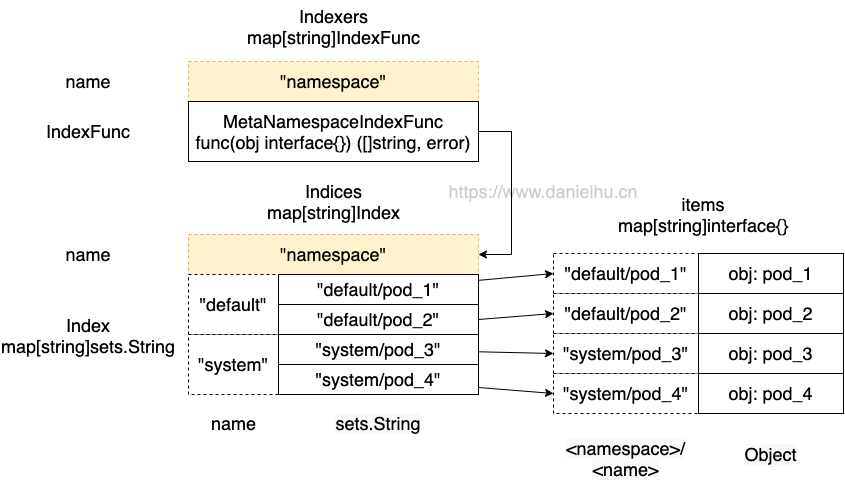

# Indexer&ThreadSafeStore 源码分析

## 概述

Indexer 主要依赖于 ThreadSafeStore 实现，是 client-go 提供的一种缓存机制，通过检索本地缓存可以有效降低 apiserver
的压力，今天我们来详细看下 Indexer 和对应的 ThreadSafeStore 的实现。



## Indexer 接口

Indexer 接口主要是在 Store 接口的基础上拓展了对象的检索功能

client-go/tools/cache/index.go:

```go
// Indexer extends Store with multiple indices and restricts each
// accumulator to simply hold the current object (and be empty after
// Delete).
//
// There are three kinds of strings here:
//  1. a storage key, as defined in the Store interface,
//  2. a name of an index, and
//  3. an "indexed value", which is produced by an IndexFunc and
//     can be a field value or any other string computed from the object.
type Indexer interface {
	Store
	// Index returns the stored objects whose set of indexed values
	// intersects the set of indexed values of the given object, for
	// the named index
	Index(indexName string, obj interface{}) ([]interface{}, error) // 根据索引名和给定的对象返回符合条件的所有对象
	// IndexKeys returns the storage keys of the stored objects whose
	// set of indexed values for the named index includes the given
	// indexed value
	IndexKeys(indexName, indexedValue string) ([]string, error) // 根据索引名和索引值返回符合条件的所有对象的 key
	// ListIndexFuncValues returns all the indexed values of the given index
	ListIndexFuncValues(indexName string) []string // 列出索引函数计算出来的所有索引值
	// ByIndex returns the stored objects whose set of indexed values
	// for the named index includes the given indexed value
	ByIndex(indexName, indexedValue string) ([]interface{}, error) // 根据索引名和索引值返回符合条件的所有对象
	// GetIndexers return the indexers
	GetIndexers() Indexers // 获取所有的 Indexers，对应 map[string]IndexFunc 类型

	// AddIndexers adds more indexers to this store. This supports adding indexes after the store already has items.
	AddIndexers(newIndexers Indexers) error // 这个方法要在数据加入存储前调用，添加更多的索引方法，默认只通过 namespace 检索
}
```

Indexer 的默认实现是 cache

client-go/tools/cache/store.go:

```go
// `*cache` implements Indexer in terms of a ThreadSafeStore and an
// associated KeyFunc.
type cache struct {
	// cacheStorage bears the burden of thread safety for the cache
	cacheStorage ThreadSafeStore
	// keyFunc is used to make the key for objects stored in and retrieved from items, and
	// should be deterministic.
	keyFunc KeyFunc
}
```

cache 对应两个方法体实现完全一样的 New 函数：

```go
// NewStore returns a Store implemented simply with a map and a lock.
func NewStore(keyFunc KeyFunc) Store {
	return &cache{
		cacheStorage: NewThreadSafeStore(Indexers{}, Indices{}),
		keyFunc:      keyFunc,
	}
}

// NewIndexer returns an Indexer implemented simply with a map and a lock.
func NewIndexer(keyFunc KeyFunc, indexers Indexers) Indexer {
	return &cache{
		cacheStorage: NewThreadSafeStore(indexers, Indices{}),
		keyFunc:      keyFunc,
	}
}
```

这里涉及到两个类型：

1. KeyFunc
2. ThreadSafeStore

我们先看一下 Indexer 的 Add()、Update() 等方法是怎么实现的：

```go
// Add inserts an item into the cache.
func (c *cache) Add(obj interface{}) error {
	key, err := c.keyFunc(obj)
	if err != nil {
		return KeyError{obj, err}
	}
	c.cacheStorage.Add(key, obj)
	return nil
}

// Update sets an item in the cache to its updated state.
func (c *cache) Update(obj interface{}) error {
	key, err := c.keyFunc(obj)
	if err != nil {
		return KeyError{obj, err}
	}
	c.cacheStorage.Update(key, obj)
	return nil
}
```

可以看到这里的逻辑就是调用 keyFunc() 方法获取 key，然后调用 cacheStorage.Xxx() 方法完成对应增删改查过程。KeyFunc 类型是这样定义的：

```go
type KeyFunc func(obj interface{}) (string, error)
```

也就是给一个对象，返回一个字符串类型的 key。KeyFunc 的一个默认实现如下：

```go
func MetaNamespaceKeyFunc(obj interface{}) (string, error) {
	if key, ok := obj.(ExplicitKey); ok {
		return string(key), nil
	}
	objName, err := ObjectToName(obj)
	if err != nil {
		return "", err
	}
	return objName.String(), nil
}
```

可以看到一般情况下返回值是 `<namespace>/<name>` ，如果 namespace 为空则直接返回 name。类似的还有一个叫做 IndexFunc
的类型，定义如下：

```go
type IndexFunc func(obj interface{}) ([]string, error)
```

这是给一个对象生成 Index 用的，一个通用实现如下，直接返回对象的 namespace 字段作为 Index

```go
func MetaNamespaceIndexFunc(obj interface{}) ([]string, error) {
	meta, err := meta.Accessor(obj)
	if err != nil {
		return []string{""}, fmt.Errorf("object has no meta: %v", err)
	}
	return []string{meta.GetNamespace()}, nil
}
```

下面我们直接来看 cacheStorage 是如果实现增删改查的。

## ThreadSafeStore

ThreadSafeStore 是 Indexer 的核心逻辑所在，Indexer 的多数方法是直接调用内部 cacheStorage 属性的方法实现的，同样先看接口定义：

client-go/tools/cache/thread_safe_store.go

```go
type ThreadSafeStore interface {
	Add(key string, obj interface{})
	Update(key string, obj interface{})
	Delete(key string)
	Get(key string) (item interface{}, exists bool)
	List() []interface{}
	ListKeys() []string
	Replace(map[string]interface{}, string)
	Index(indexName string, obj interface{}) ([]interface{}, error)
	IndexKeys(indexName, indexedValue string) ([]string, error)
	ListIndexFuncValues(name string) []string
	ByIndex(indexName, indexedValue string) ([]interface{}, error)
	GetIndexers() Indexers

	// AddIndexers adds more indexers to this store. This supports adding indexes after the store already has items.
	AddIndexers(newIndexers Indexers) error
	// Resync is a no-op and is deprecated
	Resync() error
}
```

对应实现：

```go
type threadSafeMap struct {
	lock  sync.RWMutex
	items map[string]interface{}

	// index implements the indexing functionality
	index *storeIndex
}

type storeIndex struct {
	// indexers maps a name to an IndexFunc
	indexers Indexers
	// indices maps a name to an Index
	indices Indices
}
```

这里的 Indexers 和 Indices 是：

```go
// Index maps the indexed value to a set of keys in the store that match on that value
type Index map[string]sets.String

// Indexers maps a name to an IndexFunc
type Indexers map[string]IndexFunc

// Indices maps a name to an Index
type Indices map[string]Index
```

对照图片理解一下这几个字段的关系：`Indexers` 里存的是 Index 函数 map，一个典型的实现是字符串 `namespace` 作为 key，
IndexFunc 类型的实现 `MetaNamespaceIndexFunc` 函数作为 value，
也就是我们希望通过 namespace 来检索时，通过 Indexers 可以拿到对应的计算 Index 的函数，
接着拿着这个函数，把对象穿进去，就可以计算出这个对象对应的 key，
在这里也就是具体的 namespace 值，比如 `default`、`kube-system` 这种。
然后在 Indices也是一个map，其key与`Indexers`的key相同，通过同名的key，获取到的 `Index` 也是一个 map，key 是上面计算出来的
`default` 这种 namespace 值，value 是一个 set，
而 set 表示的是这个 `default` 命名空间下的一些具体 pod的名称，类似 `<namespace>/<name>` 这类字符串。
最后拿着这种 key，就可以在 items 里检索到对应的对象了。


## threadSafeMap.Xxx()

比如 Add()/Update() 方法代码如下：

```go
func (c *threadSafeMap) Add(key string, obj interface{}) {
	c.Update(key, obj)
}
func (c *threadSafeMap) Update(key string, obj interface{}) {
	c.lock.Lock()
	defer c.lock.Unlock()
	oldObject := c.items[key]
	c.items[key] = obj
	c.index.updateIndices(oldObject, obj, key)
}
```

可以看到更复杂的逻辑在 updateIndices 方法里，我们继续来看：

client-go/tools/cache/thread_safe_store.go:

```go
// updateIndices modifies the objects location in the managed indexes:
// - for create you must provide only the newObj
// - for update you must provide both the oldObj and the newObj
// - for delete you must provide only the oldObj
// updateIndices must be called from a function that already has a lock on the cache
func (i *storeIndex) updateIndices(oldObj interface{}, newObj interface{}, key string) {
	for name := range i.indexers {
		i.updateSingleIndex(name, oldObj, newObj, key)
	}
}
```

继续看updateSingleIndex方法：

```go
// updateSingleIndex modifies the objects location in the named index:
// - for create you must provide only the newObj
// - for update you must provide both the oldObj and the newObj
// - for delete you must provide only the oldObj
// updateSingleIndex must be called from a function that already has a lock on the cache
func (i *storeIndex) updateSingleIndex(name string, oldObj interface{}, newObj interface{}, key string) {
	var oldIndexValues, indexValues []string
	indexFunc, ok := i.indexers[name]
	if !ok {
		// Should never happen. Caller is responsible for ensuring this exists, and should call with lock
		// held to avoid any races.
		panic(fmt.Errorf("indexer %q does not exist", name))
	}
	if oldObj != nil { // 添加场景这里是 nil，如果是更新，就需要删除旧对象的索引了 -- 即使是同一个对象，如果其属性发生变更也可能导致索引值变更，因此需要删除旧的索引值。
		var err error
		oldIndexValues, err = indexFunc(oldObj)
		if err != nil {
			panic(fmt.Errorf("unable to calculate an index entry for key %q on index %q: %v", key, name, err))
		}
	} else {
		oldIndexValues = oldIndexValues[:0]
	}

	if newObj != nil { // 删除场景这里是 nil，如果是添加/更新，就需要添加新对象的索引
		var err error
		indexValues, err = indexFunc(newObj)
		if err != nil {
			panic(fmt.Errorf("unable to calculate an index entry for key %q on index %q: %v", key, name, err))
		}
	} else {
		indexValues = indexValues[:0]
	}

	index := i.indices[name] //获取与Indexer同名的Index
	if index == nil { //如果Index为nil则创建一个
		index = Index{}
		i.indices[name] = index
	}

  //如果新旧索引都只有一个且一样，则直接返回
	if len(indexValues) == 1 && len(oldIndexValues) == 1 && indexValues[0] == oldIndexValues[0] {
		// We optimize for the most common case where indexFunc returns a single value which has not been changed
		return
	}

  //删除旧索引值中的 ·对象的存储值·（通过KeyFunc函数计算得到）
	for _, value := range oldIndexValues {
		i.deleteKeyFromIndex(key, value, index)
	}

	//添加新索引值中的 ·对象的存储值·（通过KeyFunc函数计算得到）
	for _, value := range indexValues {
		i.addKeyToIndex(key, value, index)
	}
}
```

接下来看看 deleteKeyFromIndex 和addKeyToIndex 方法：

```go
func (i *storeIndex) deleteKeyFromIndex(key, indexValue string, index Index) {
	set := index[indexValue]
	if set == nil {
		return
	}
	set.Delete(key)
	// If we don't delete the set when zero, indices with high cardinality
	// short lived resources can cause memory to increase over time from
	// unused empty sets. See `kubernetes/kubernetes/issues/84959`.
	if len(set) == 0 {
		delete(index, indexValue)
	}
}

func (i *storeIndex) addKeyToIndex(key, indexValue string, index Index) {
	set := index[indexValue]
	if set == nil {
		set = sets.String{}
		index[indexValue] = set
	}
	set.Insert(key)
}
```

## Index() 等实现

最后看几个具体方法等实现

### Index() 方法

来看一下 Index() 方法的实现，Index() 方法的作用是给定一个 obj 和 indexName，比如 pod1和 “namespace”，然后返回 pod1 所在
namespace 下的所有 pod。

client-go/tools/cache/thread_safe_store.go:

```go
func (c *threadSafeMap) Index(indexName string, obj interface{}) ([]interface{}, error) {
	c.lock.RLock()
	defer c.lock.RUnlock()

	storeKeySet, err := c.index.getKeysFromIndex(indexName, obj) //c.index的类型是storeIndex
	if err != nil {
		return nil, err
	}

  // storeKey 也就是 "default/pod_1" 这种字符串，通过其就可以到 items map 里提取需要的 obj 了
	list := make([]interface{}, 0, storeKeySet.Len())
	for storeKey := range storeKeySet {
		list = append(list, c.items[storeKey])
	}
	return list, nil
}

func (i *storeIndex) getKeysFromIndex(indexName string, obj interface{}) (sets.String, error) {
	indexFunc := i.indexers[indexName] // 提取索引函数，比如通过 "namespace" 提取到 MetaNamespaceIndexFunc
	if indexFunc == nil {
		return nil, fmt.Errorf("Index with name %s does not exist", indexName)
	}

	indexedValues, err := indexFunc(obj) //获取对象的索引值，比如 "default"
	if err != nil {
		return nil, err
	}
	index := i.indices[indexName] // indexName 例如 "namespace"，这里可以查到 Index

	var storeKeySet sets.String
	if len(indexedValues) == 1 {
		// In majority of cases, there is exactly one value matching.
		// Optimize the most common path - deduping is not needed here.
		storeKeySet = index[indexedValues[0]] // 多数情况对应索引值为1到场景，比如用 namespace 时，值就是唯一的。此时直接返回，不需要去重
	} else {
		// Need to de-dupe the return list.
		// Since multiple keys are allowed, this can happen.
		storeKeySet = sets.String{}
		for _, indexedValue := range indexedValues {
		  // 对应不为1场景，此时需要去重
			for key := range index[indexedValue] {
				storeKeySet.Insert(key)
			}
		}
	}

	return storeKeySet, nil
}
```

### ByIndex() 方法

相比 Index()，这个函数要简单的多，直接传递 indexedValue，也就不需要通过 obj 去计算 key 了，例如 indexName == namespace & indexValue == default 就是直接检索 default 下的资源对象。

```go
func (c *threadSafeMap) ByIndex(indexName, indexedValue string) ([]interface{}, error) {
	c.lock.RLock()
	defer c.lock.RUnlock()

	set, err := c.index.getKeysByIndex(indexName, indexedValue)
	if err != nil {
		return nil, err
	}
	list := make([]interface{}, 0, set.Len())
	for key := range set {
		list = append(list, c.items[key])
	}

	return list, nil
}

func (i *storeIndex) getKeysByIndex(indexName, indexedValue string) (sets.String, error) {
	indexFunc := i.indexers[indexName]
	if indexFunc == nil {
		return nil, fmt.Errorf("Index with name %s does not exist", indexName)
	}

	index := i.indices[indexName]
	return index[indexedValue], nil
}
```

### IndexKeys() 方法
和上面返回 obj 列表不同，这里只返回 key 列表，就是 []string{“default/pod_1”} 这种数据

```go
func (c *threadSafeMap) IndexKeys(indexName, indexedValue string) ([]string, error) {
	c.lock.RLock()
	defer c.lock.RUnlock()

	set, err := c.index.getKeysByIndex(indexName, indexedValue)
	if err != nil {
		return nil, err
	}
	return set.List(), nil
}
```

### Replace() 方法
Replace() 的实现简单粗暴，给一个新 items map，直接替换到 threadSafeMap.items 中，然后重建索引。

```go
func (c *threadSafeMap) Replace(items map[string]interface{}, resourceVersion string) {
	c.lock.Lock()
	defer c.lock.Unlock()
	c.items = items

	// rebuild any index
	c.index.reset()
	for key, item := range c.items {
		c.index.updateIndices(nil, item, key)
	}
}

func (i *storeIndex) reset() {
	i.indices = Indices{}
}
```

