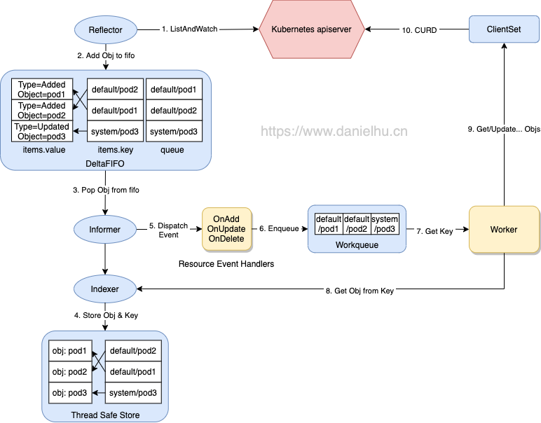

# Client-go 整体介绍

## 整体流程

## 相关模块

- `Reflector`: Reflector向ApiServer`watch`特定类型的资源，拿到变更通知后将其丢到DeltaFIFO中；
- `Informer`: Informer从DeltaFIFO中`pop`相应对象，然后通过Indexer将对象和索引放到本地Cache中，再触发相应的事件处理函数（ResourceEventHandles）运行。
- `Indexer`: Indexer主要提供根据一定条件检索一个对象的能力（类比数据库就是，一个Indexer对应一张表数据，key则是索引），典型的实现是通过namespace/name来构建key，通过Thread Safe Store来存储对象。
- `WorkQueue`: WorkQueue一般使用延时队列实现，在ResourceEventHandles中会完成将对象的key放入WorkQueue的过程，然后我们在自己的逻辑代码里从WorkQueue中消费这些key。
- `ClientSet`: ClientSet提供资源的CRUD能力，与ApiServer交互。
- `Resource Event Handles`: 一般在ResourceEventHandles中添加一些简单的过滤功能，判断哪些对象需要添加到WorkQueue中进一步处理；对于需要加入WorkQueue中的对象，就提取其key，然后入队；
- `Worker`: Worker指我们自己的业务代码处理过程，在这里可以直接收到WorkQueue中的任务，可以通过indexer从本地缓存中提取对象，并通过ClientSet实现对象的增删改查逻辑。

